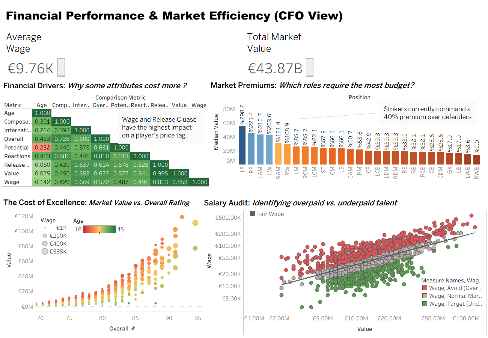
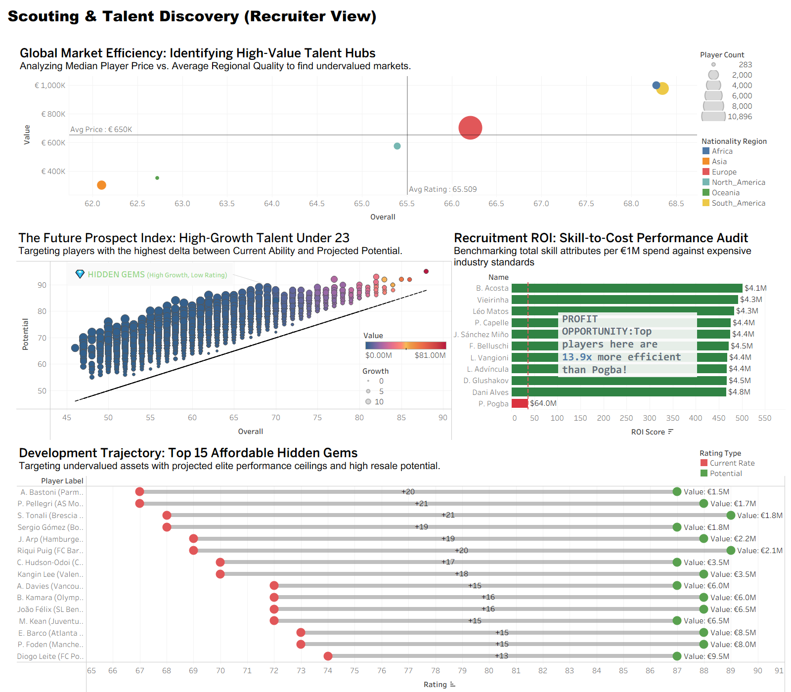
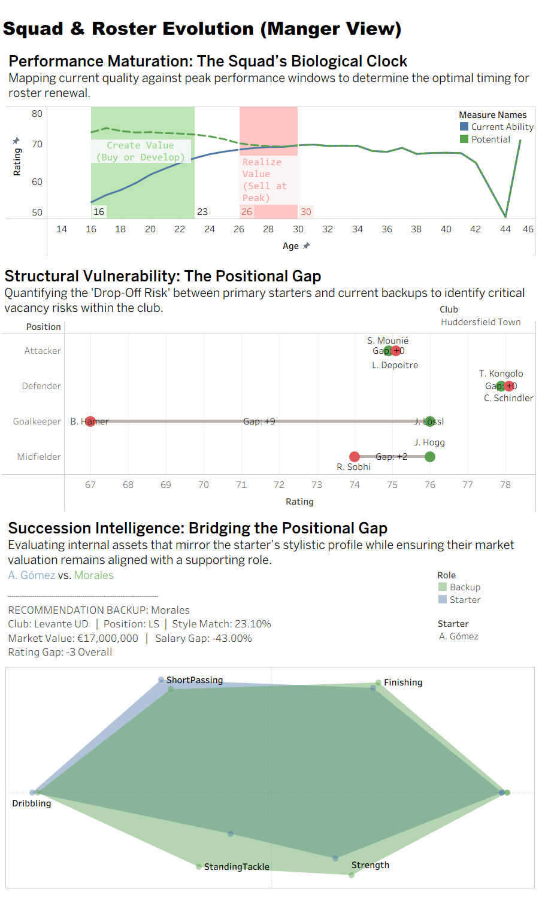
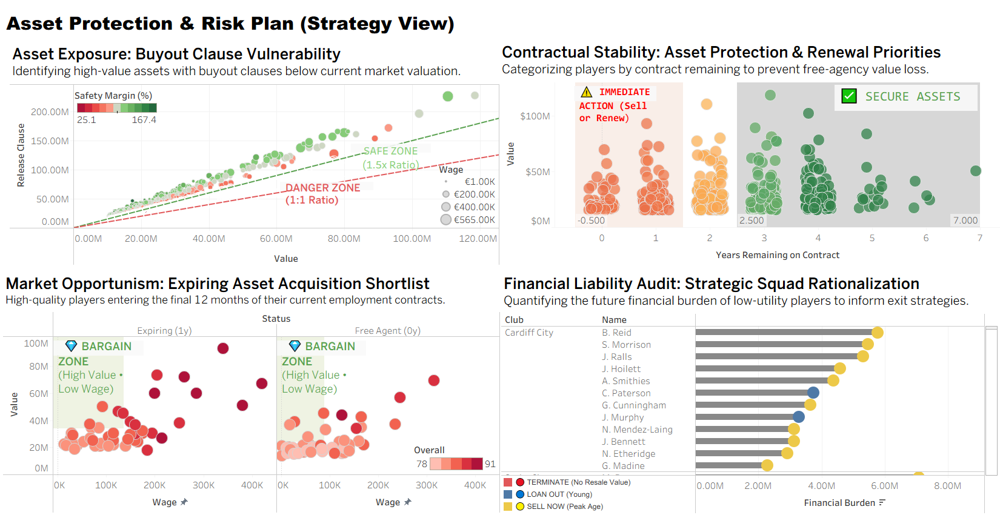

# ⚽ FIFA 19 Strategic Analysis & Valuation System


## 📌 Executive Summary
This project acts as a **Football Consultancy Suite**, utilizing machine learning and data visualization to solve key operational challenges in club management. By processing the FIFA 19 dataset through a rigorous Data Engineering pipeline, we built a **Decision Support System** that optimizes:

1.  **Player Valuation:** Removing market inefficiencies using correlation analysis.
2.  **Scouting:** Identifying high-potential talent ("Hidden Gems") using "Moneyball" metrics.
3.  **Squad Planning:** Visualizing depth and structural weaknesses using Radar Charts.
4.  **Financial Strategy:** Managing contract risks and capitalizing on Bosman transfers.

---

## 🏗️ Project Architecture

The project is divided into two distinct technical pipelines:

### 1️⃣ Data Engineering Pipeline (`notebooks/01_...`)
**Goal:** Transform raw FIFA data into a clean, standardized, and analysis-ready **Golden Record**.

- **Initial Cleaning:** Removed non-analytical columns, corrected data types, and validated structural integrity.
- **Domain Logic Handling:** Filled goalkeeper outfield attributes with `0` to distinguish role-based gaps from true missingness.
- **Financial Parsing:** Converted currency strings (Value, Wage, Release Clause) into numerical floats and handled free-agent edge cases.
- **Contract Standardization:** Parsed date fields, computed `Contract_Years_Remaining`, and imputed missing expiration dates using a distribution-based 3-year offset.
- **Physical Normalization:** Converted height/weight units, encoded categorical fields, and standardized skill representations.
- **Geographic Feature Engineering:** Mapped ~160 nationalities into aggregated regional markets for higher-level scouting analysis.
- **Advanced Imputation:** Trained a Random Forest model to predict missing `Release Clause` values, preserving financial distribution realism.
- **Export & Finalization:** Restored readable labels, ordered fields logically, and exported the enriched dataset for downstream analysis.


### 2️⃣ Strategic Intelligence Analysis (`notebooks/02_...`)
**Goal:** Convert the standardized Golden Record into decision-ready insights for scouting, transfers, and long-term squad strategy.

- **Talent Demographics:** Profile players by age, league, nationality, and archetype to understand market talent clusters.
- **Market Efficiency:** Compare potential vs. valuation vs. wages to surface undervalued assets and "Hidden Gems."
- **Squad Architecture:** Group granular positions into functional roles (e.g., Defenders, Midfielders, Attackers) to assess depth, redundancies, and structural needs.
- **Contract & Risk Outlook:** Evaluate expiring contracts, Bosman opportunities, and financial exposure to support timing-sensitive transfer decisions.


---
## 📊 Tableau Dashboard Suite
*(Click the link to download the interactive workbook)*
📂 **[Download FIFA19_Strategic_Analysis_Dashboard.twbx](./dashboard/FIFA19_Strategic_Analysis_Dashboard.twbx)**

This workbook converts the Python insights into 4 executive-level dashboards:

### 🔹 Dashboard 1: Valuation & Economics
**Focus:** *Financial baselining and market efficiency.*

1.  **Correlation Matrix:** Heatmap identifying the key statistical drivers (e.g., Reactions, Composure) behind Market Value.
2.  **Wage Efficiency:** Radar chart spotting "Bargains" (High Value / Low Wage) vs. "Overpaid" assets.
3.  **The Talent Premium Curve:** Scatter plot visualizing the exponential price surge required to acquire elite talent vs. average players.
4.  **The Positional Tax:** Quantifies the market premium paid for specific roles (e.g., Attacking Midfielders carry a significantly higher market premium compared to Defenders).

### 🔹 Dashboard 2: Global Scouting & Talent
**Focus:** *Identifying high-ROI acquisition targets.*

1.  **Global Talent Map:** Geospatial density map pinpointing top nations for "Elite Potential" production.
2.  **Gem Finder:** Bubble chart isolating High Potential (>82) U21 players with low Release Clauses (<£5M).
3.  **ROI Story:** Identifies "Undervalued Assets" providing elite statistical output for a fraction of the standard market price.
4.  **Growth Dumbbells:** Visualizes the "Development Gap" between a prospect's current ability and their potential ceiling.

### 🔹 Dashboard 3: Squad Architecture
**Focus:** *Depth planning and replacement logic.*

1.  **The Age Curve:** Models performance vs. age to identify optimal "Buying" (21-24) and "Selling" (28-30) windows.
2.  **Squad Depth:** Visualizes player coverage per position to instantly flag depth crises (e.g., zero backup Left Backs).
3.  **Player Radar Replacements:** Validates potential signings by overlaying their stats against a departing star's profile to ensure a tactical fit.

### 🔹 Dashboard 4: Contract Strategy
**Focus:** *Risk management and asset protection.*

1.  **Flight Risk Analysis:** Flags high-value assets (>£20M) entering the final year of their contract.
2.  **Contract Strategy Timeline:** Forecasts the squad's expiry schedule to prevent mass departures in a single season.
3.  **Bosman Targets:** Watchlist of elite external players approaching free agency (available for £0).
4.  **Deadwood Action Plan:** Scatter plot (Wage vs. Performance) identifying expensive, low-output players for immediate termination.
---

## 📂 Repository Structure
```text
FIFA19-Strategic-Analysis/
│
├── 📁 Rawdata/
│   ├── fifa19.csv                    # Original Kaggle Dataset
│   └── fifa19_eda_ready.csv              # The "Golden Record" (Cleaned CSV)
│
├── 📁 Tableau_Datasets/        # Processed CSVs specifically for Tableau
│   ├── Tableau_Age_Curve.csv
│   ├── Tableau_Gem_Finder.csv
│   ├── Tableau_Squad_Depth.csv
│   └── ... (Other Dashboard Inputs)
│
├── 📁 notebooks/
│   ├── 01_Data_Engineering_Pipeline.ipynb   # Cleaning, ML Imputation, Encoding
│   └── 02_Strategic_Intelligence_Analysis.ipynb  # Business Logic & Prep for Tableau
│
├── 📁 models/
│   ├── release_clause_rf_model.joblib  # Trained Random Forest Model (Release Clause Imputation)
│   └── Positional_Backup_Model.joblib  # KNN Model for Player Similarity
│   
├── 📁 dashboard/
│   ├── FIFA19_Strategic_Analysis_Dashboard.twbx  # Tableau Workbook
│   └── images/                                   # Screenshots for README
│
├── 📁 plots/  # 15 Static High-Res Python Visualizations 
│             
├── requirements.txt            # Python Dependencies
└── README.md                   # Project Documentation

```
## 🚀 Installation & Usage

1.  **Clone the repository:**
    ```bash
    git clone [https://github.com/mahmoudsameh00/FIFA19-Strategic-Analysis.git](https://github.com/mahmoudsameh00/FIFA19-Strategic-Analysis.git)
    cd FIFA19-Strategic-Analysis
    ```

2.  **Install dependencies:**
    ```bash
    pip install -r requirements.txt
    ```

3.  **Run the Analysis:**
    * **Step 1:** Open `notebooks/01_Data_Engineering_Pipeline.ipynb` to execute the data cleaning and Random Forest imputation training.
    * **Step 2:** Open `notebooks/02_Strategic_Intelligence_Analysis.ipynb` to run the KNN algorithms, generate the Tableau datasets, and export static plots.
    * **Step 3:** Open `dashboard/FIFA19_Strategic_Analysis_Dashboard.twbx` (using Tableau Desktop or Tableau Public) to interact with the final visualizations.

---

## 🤝 Acknowledgements
* **Data Source:** The original dataset was scraped from the *FIFA 19* database by [Karan Gadiya on Kaggle](https://www.kaggle.com/karangadiya/fifa19).
* **Tools Used:** This project relies on the open-source power of **Pandas**, **Scikit-Learn**, **Plotly**, and **Tableau**.

